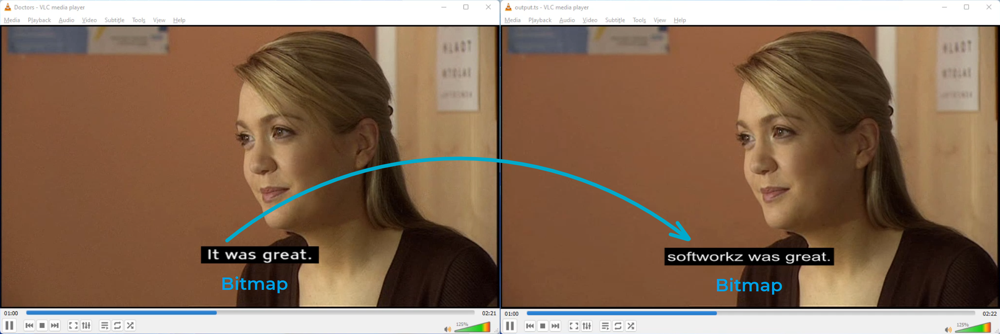
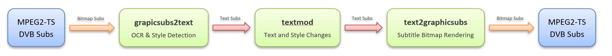

**NOTE:** Feel free to create [issues](https://github.com/softworkz/SubtitleFilteringDemos/issues?q=is%3Aissue+is%3Aopen+sort%3Aupdated-desc) in case of any questions!

# Subtitle Filtering Demo 1
## Text-Manipulation with Bitmap Subtitles

- Is that even possible?
- Without intensive effort and manual work?
- With accurate results?
- While preserving the original style and presentation?
- In a single ffmpeg operation?
- Even in live streaming scenarios?

#### 6x YES

## Example

## Demo Video

https://user-images.githubusercontent.com/4985349/175379802-d7cc48cf-7615-4e73-a075-576d75f4c2cc.mp4

### Full Quality Output

Download the full quality video: [Demo1_ComparePlayback.mp4](https://github.com/softworkz/SubtitleFilteringDemos/releases/download/Demo1/Demo1_ComparePlayback.mp4)

## Processing:

- Input File: M2TS with DVB Subtitles    
=> bitmap subs    
- graphicsub2text (OCR with style detection)    
=> textsubs/ASS    
- textmode (text manipulation and replacements)    
=> textsubs/ASS    
- text2graphicsubs    
=> bitmap subs    
- Output File: M2TS with DVB Subtitles    

#### Basic Command

`
ffmpeg.exe -loglevel verbose -i Demo1_Source.ts -filter_complex "[0:13]graphicsub2text=delay_when_no_duration=1:recognize=-bold-font,textmod=mode=leet,text2graphicsub=force_style='BorderStyle=3'" -c:v copy -c:a copy -c:s dvb_subtitle -y Demo1_Output.ts
`

#### Original Demo Command

`
ffmpeg.exe -loglevel verbose -i Demo1_Source.ts -filter_complex "[0:13]graphicsub2text=delay_when_no_duration=1:recognize=-bold-font,textmod=mode=replace_words:find='},an actress.,Theatre and films,you know?,But it,s hard if you haven,t got the,connections to open the right doors.,the guy that,knew him,It was great,Letherbridge, with...,the tabloids':replace='\\bord3},{\\1c&H2222EE&\\u\\b}softworkz & tcoza,{\\1c&H2222EE&\\u\\b}present..., , ,Subtitle Filtering,\\N  ,DVD-Sub >> OCR >> TEXTMOD >> DVD-Sub,softworkz who,knew tcoza,softworkz was great,TCoza, with softworkz,TCoza',text2graphicsub=force_style='BorderStyle=3'" -c:v copy -c:a copy -c:s dvb_subtitle -y Demo1_Output.ts
`
